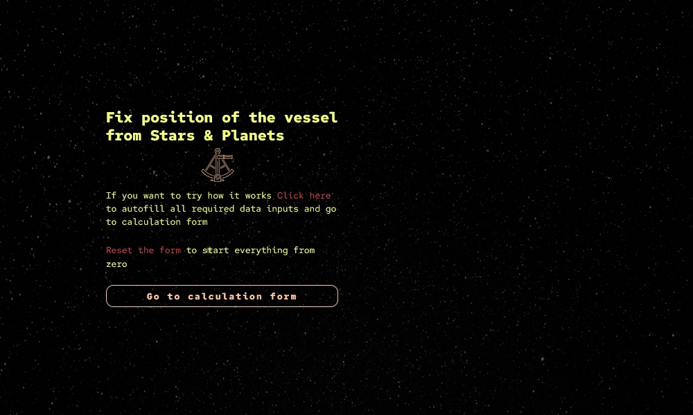
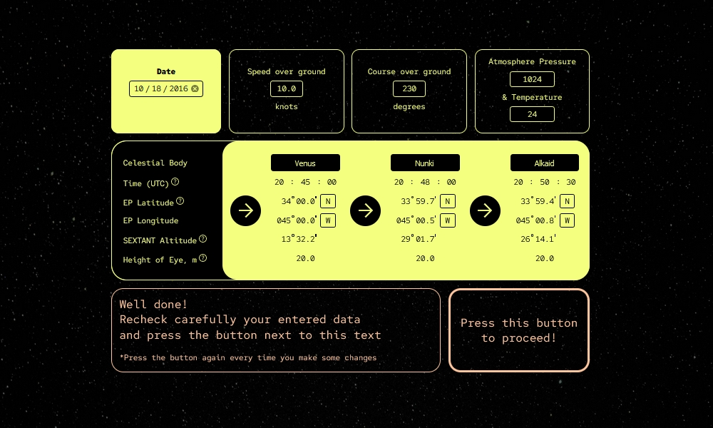
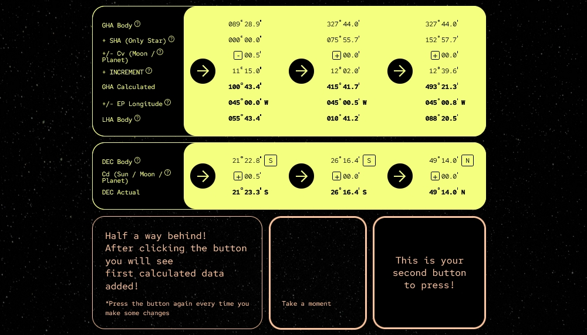
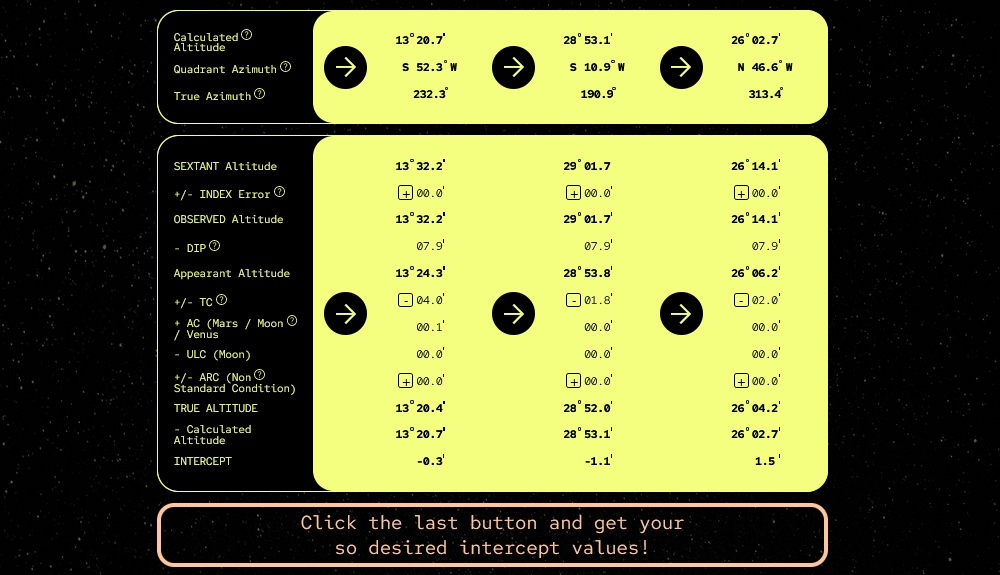

# Fix Position of the Vessel from Stars & Planets

This project of celestial navigation will guide you through the calculation process to get the necessary data for fixing of position of the vessel in the middle of the ocean.

## About the project

### Overview

Based on the previous maritime experience there are two different approaches for celestial fixing of the vessel's position: fully manual and fully auto using the software. First approach requires good understanding and knowledge of the process as well as takes a lot of time. On the other hand the auto process is like the black box where maritime officers have no idea what's going on. The main goal of my project is to combine this two methods and provide calculation sheet where maritime officers have guide what data to enter and from where to take it plus automative calculation of difficult formulas which economs a lot of time and keep knoweledge of the process always high.

### How to use

The calculation form is 100% intuitively understandable. Just fill up all necessary data fields and press the button. Every data field has pop-up message with the desired format to be entered. Don't be afraid to make mistakes as minor errors will be automatically formatted and major ones highlighted.  Once you press the button your calculation will be evaluated on the stage you are so you need to press the button again if you make some changes with your entered data. Every heading on the left side of the form with a question mark next to it is clickable and contains some theoretical information. On the presentation screen you can autofill all necessary data fields and check how it works or fully reset the form and start everything from zero. Enjoy!

### Preview

### Links

[Celestial Navigation Calculation Program](https://vvv-sss.github.io/celestial-navigation/)

### Built with

- HTML5
- CSS
- Javascript
- JQuery

## Author

- Volodymyr Serbulenko
- E-mail: serbulenko1volodymyr@gmail.com
